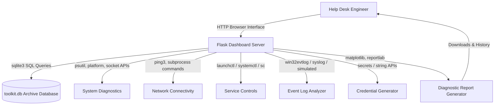

# IT Support Automation Toolkit

A web-based **"Swiss Army Knife for IT Support"** designed to automate everyday troubleshooting, monitoring, and auditing tasks performed by Help Desk Engineers and IT Support Specialists.

The toolkit features a premium, responsive dashboard styled with a modern **matte dark grey, emerald green, and white** color scheme. It adapts dynamically to the host operating system (Windows, macOS, Linux), resolving raw socket permission boundaries and API differences under the hood.

---

## 🛠️ Architecture & System Design



---

## 🌟 Key Features

### 🖥️ Module 1: System Info Collector
Gathers primary system indicators prior to troubleshooting sessions:
- Hostname and logged username.
- Full operating system platform build and release.
- Hardware: CPU model, processor core count, and dynamic memory capacity.
- Networking: Local subnet IP, public router IP, and active network card MAC address.

### 💾 Module 2: Disk Health Analyzer
Checks space limitations on active storage volumes:
- Audits mount paths, total storage size, free space, and usage ratios.
- **Alert Logic**: Highlights drives exceeding 90% usage as **Critical** or 75% usage as **Warning**.
- Renders storage allocation visuals dynamically on reload using a backend `matplotlib` donut chart.

### 🌐 Module 3: Network Connectivity Tester
Diagnostic utility testing socket streams:
- **Ping Test**: Latency test targeting Google DNS servers.
- **DNS Resolution**: Validates local tables resolve public queries.
- **Gateway Probe**: Autodetects host router gateway and queries status.
- *OS-safe*: Automatically falls back from raw socket `ping3` to standard subprocess ping to bypass administrative privilege errors.

### ⚙️ Module 4: Service Health Checker
Queries and monitors essential service daemons:
- Adapts checks dynamically to host platform:
  - **Windows**: Spooler (Print Spooler), wuauserv (Windows Update), Dhcp (DHCP Client), Dnscache (DNS Client).
  - **macOS**: org.cups.cupsd, com.openssh.sshd, org.apache.httpd, com.apple.mDNSResponder.
  - **Linux**: cups, ssh, nginx, systemd-resolved.
- Provides interactive triggers to **Start** or **Stop** services, prompting warning messages if administrator privileges are lacking.

### 🔑 Module 5: Password Generator
Generates secure user credentials:
- Custom criteria sliders (length, numerical digits, special symbols, casing).
- Renders real-time visual entropy strength indicator blocks (**Weak**, **Medium**, **Strong**).
- Integrates quick copy-to-clipboard actions.

### 📜 Module 6: Event Log Analyzer
Inspects warning and critical logs for audit reviews:
- Reads system log tables: queries Windows registry event logs, macOS system logs, or Linux logs.
- Features simulated fallbacks containing real-world IT error templates to ensure functional out-of-the-box portfolio demonstrations.
- Filters log files by severity level and keyword searches, with quick CSV export triggers.

### 📈 Module 7: Process Monitor
Live task viewer:
- Lists running processes sorted by active CPU usage and RSS memory footprint.
- Integrates local search inputs to locate active tasks by name or PID.
- Supports **End Task** triggers to terminate runaway processes directly.

### 📦 Module 8: Software Inventory
Aggregates catalog records of installed application suites:
- Resolves directories differently per platform (registry lookups on Windows vs bundle scans in `/Applications` on macOS).
- Integrates fast keyword search filters.

### 📊 Module 9: Report Generator & Archive
Unified summary compiling tool:
- Consolidates system, disk, network, services, and log analytics.
- Exports to structural raw **CSV files** or styled **PDF reports**.
- PDF includes tables, color markers, and embedded capacity charts generated using `matplotlib` and `reportlab`.
- Records historical summaries in an SQLite archive database for downloads management.

---

## 🗄️ Database Design (SQLite)

The application utilizes an SQLite archive database (`toolkit.db`) to record diagnostic report generation logs:

### `reports` Table Schema
| Column | Type | Constraints | Description |
| :--- | :--- | :--- | :--- |
| `id` | INTEGER | PRIMARY KEY AUTOINCREMENT | Unique record index |
| `timestamp` | DATETIME | DEFAULT CURRENT_TIMESTAMP | Generation date and time |
| `report_name` | TEXT | NOT NULL | Output filename |
| `file_path` | TEXT | NOT NULL | Path location on local system |
| `format` | TEXT | NOT NULL | File type (e.g. PDF, CSV) |
| `summary` | TEXT | | Brief overview of system diagnostics |

---

## 🎨 UI Design System

A modern dashboard aesthetic inspired by developer dark-modes:
- **Matte Dark Grey**: `#0b0c10` (body background), `#1f2833` (cards and sidebars) to reduce eye strain.
- **Vibrant Green Accent**: `#10b981` (buttons, status meters, active states) for clear visual feedback.
- **White and Muted Light Grey**: `#f3f4f6` (primary text), `#9ca3af` (secondary tags).
- **Typography**: `Inter` font for clean UI layout, and `JetBrains Mono` for logs and addresses.
- **Micro-Animations**: Hover card offsets, pulsing online indicators, and modal fade transitions.

---

## 🚀 Setup & Execution Guide

### 1. Prerequisites
- Python 3.12 or higher.
- PIP package installer.

### 2. Dependency Installation
Install required packages using pip:
```bash
pip install -r requirements.txt
```
*(Dependencies list: Flask, psutil, ping3, pandas, matplotlib, reportlab)*

### 3. Running the Server
Run the main server module:
```bash
python app.py
```
Open a browser and navigate to the local portal:
```
http://127.0.0.1:5000/
```
